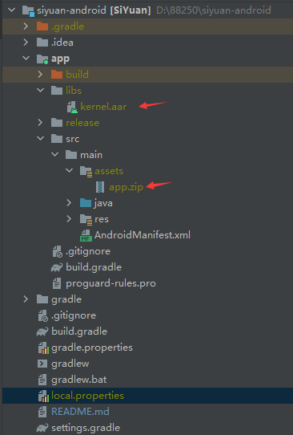
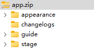

[中文](https://github.com/siyuan-note/siyuan-android/blob/master/README_zh_CN.md)

## Overview

* Please go to [SiYuan issues](https://github.com/siyuan-note/siyuan/issues) to report issues/consult discussions
* Code contributions are welcome

## Construction guide

1. Refer to [SiYuan Development Guide](https://github.com/siyuan-note/siyuan/blob/master/.github/CONTRIBUTING.md) to compile the kernel
2. Copy the resource files and package it in app/src/main/assets/app.zip
   * appearance
   * guide
   * stage
   * changelogs

Directory structure reference:

